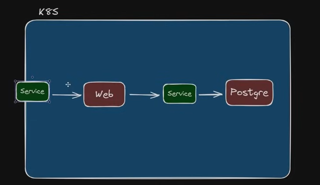

# Deploy CSharp Web App




https://chatgpt.com/share/93fbce1c-33fd-46ae-b307-fe2c1c1e1031

## Terraform
```bash
./terraform/
├── eks.tf
├── iam.tf
├── kubernetes.tf
├── main.tf
├── outputs.tf
├── variables.tf
└── vpc.tf
````

## Locally deploy
### Cluster Kubernetes no K3D
```bash
k3d cluster create meucluster --servers 3 --agents 3 -p "30000:30000@loadbalancer"
```


## Deploy EKS

### Steps

cluster eks aws

criar group user admistrator

cria conta devps4devs e adiciona ao grupo administrator

cria acesso a conta devops4devs

Com a conta devops4devs:

cria roles ec2WorkerNode e eksClusterRole

ec2WorkerNode - polices:
AmazonEC2ContainerRegistryReadOnly
AmazonEKS_CNI_Policy
AmazonEKSWorkerNodePolicy

eksClusterRole - polices:
AmazonEKSClusterPolicy

Usando cloudfoundation e o template abaixo:

https://s3.us-west-2.amazonaws.com/amazon-eks/cloudformation/2020-10-29/amazon-eks-vpc-private-subnets.yaml

cria stack cloudfoundation eks-devops4devs

cria o cluster eks-devops4devs

cria o nodegroup default no cluster eks-devops4devs

no projeto, faz o deploy em k8s/prod/deployment.yaml

kubectl apply -f k8s/deployment.yaml

Deletando..

kubectl delete -f k8s/deployment.yaml

deleta o nodegroup
deleta o cluster
deleta a infra criada pelo cloudfoudation template

### Link para a AWS:

[https://aws.amazon.com](https://aws.amazon.com)

### Link para instalação do AWS CLI:

[https://aws.amazon.com/pt/cli](https://aws.amazon.com/pt/cli)

### URL do template usado do Cloud Formation:
```
https://s3.us-west-2.amazonaws.com/amazon-eks/cloudformation/2020-10-29/amazon-eks-vpc-private-subnets.yaml
```

### Comando para obter a senha do Grafana
```bash
kubectl get secret --namespace default grafana -o jsonpath="{.data.admin-password}" | base64 --decode
```